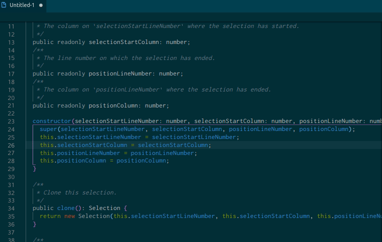

# Perfect Line Selection

This extension for Visual Studio Code does one thing and one thing only.  
Select everything on the current line without whitespace.

## Bind command to keyboard shortcut

* Open up 'Keyboard Shortcut' with (CTRL + K CTRL + S)
* Bind the command 'Perfect Line Selection: Select line without indention' to preferable keybinding.
  * Suggested keybinding: (CTRL + L)

## Execute command just as

* Open up 'Command Palette' with (CTRL + SHIFT + P)
* Search for 'Perfect Line Selection'

---

Icons made by <a href="https://www.flaticon.com/authors/pixel-perfect" title="Pixel perfect">Pixel perfect</a> from <a href="https://www.flaticon.com/" title="Flaticon">www.flaticon.com</a> is licensed by <a href="http://creativecommons.org/licenses/by/3.0/" title="Creative Commons BY 3.0" target="_blank">CC 3.0 BY</a>
